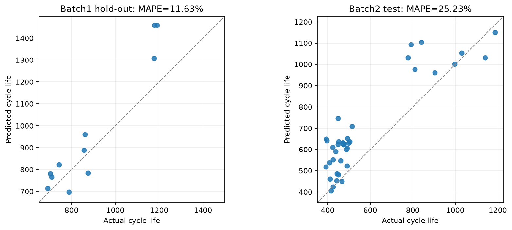

# ESS 배터리 수명 예측

초기 100사이클의 충방전 정보로 배터리의 전체 수명(`cycle_life`)을 예측한다. 수명과 연결되는 초기 열화 신호를 찾고, 충전 조건과 측정값에서 중복을 줄여 설명 가능한 회귀 모델을 만든다. 이를 통해 ESS의 셀 선별·점검 우선순위·교체 계획에 활용할 가능성을 살펴본다.

## 프로젝트 개요

- 데이터셋: MIT-Stanford Battery Dataset — Severson et al., *Nature Energy* (2019).
- 학습·검증 데이터: **Batch1 (2017-05-12), 46개 셀**.
- 평가 데이터: **Batch2 (2018-02-20), 수명 확인 39개 셀**. 수명 결측 8개는 성능 계산에서 제외.
- 태스크: **Regression — Cycle Life 예측**.
- Target: `cycle_life`, 원래 사이클 단위의 전체 수명.
- 예측 시점: 100사이클 관측 후.
- 최종 입력·모델: **`log10_dqv_var` 하나를 사용하는 선형회귀**.

데이터 확인·EDA·피처 선정·모델 선정의 근거는 Batch1만 사용한다. Batch2는 단수명 셀이 많다는 분포 관찰과 고정 모델의 최종 평가에 사용한다. Batch3은 사용하지 않는다.

## 파일 구조

```text
├── data/
│   ├── Batch1.mat                       # 원본, Git 제외
│   ├── Batch2.mat                       # 원본, Git 제외
│   └── processed/                       # 추출 CSV·NPZ, Git 제외
├── notebooks/
│   ├── 01_data_check.ipynb               # Batch1 구조 확인·추출
│   ├── 01b_batch2_extract.ipynb           # Batch2 평가 데이터 추출
│   ├── 02_eda.ipynb                      # Batch1 EDA·가설·상관
│   ├── 03_feature_engineering.ipynb       # Batch1 후보 생성·선정
│   └── 04_modeling.ipynb                 # 모델 선정·고정 평가
├── model/
│   └── train_model.py                   # 노트북과 공유하는 학습·평가 코드
├── outputs/
│   ├── eda_model_selection.md
│   ├── model_comparison.csv
│   ├── model_selection_manifest.json
│   ├── model_performance.csv
│   ├── model_predictions.csv
│   ├── model_predictions.png
│   ├── model_metrics.json
│   └── battery_model.joblib
├── output/pdf/
│   └── DS-MINI-Design-울산캠퍼스_3반-최병준.pdf
├── requirements.txt
└── README.md
```

[DAY 1 설계 보고서](output/pdf/DS-MINI-Design-울산캠퍼스_3반-최병준.pdf)는 EDA와 모델 전략을 담는다. DAY 2의 실제 모델 비교·평가 결과는 아래 내용과 `outputs/`에서 확인할 수 있다.

## 환경 설정

```bash
git clone https://github.com/chubuzu/Data_Analytics_MiniProject_Skala.git
cd Data_Analytics_MiniProject_Skala
python3 -m venv .venv
.venv/bin/python -m pip install -r requirements.txt
.venv/bin/python -m jupyter notebook
```

1. 원본을 `data/Batch1.mat`, `data/Batch2.mat`에 둔다.
2. `notebooks/`에서 `01_data_check` → `02_eda` → `03_feature_engineering`을 실행하고, `01b_batch2_extract`로 평가 데이터 형식을 준비한다.
3. `04_modeling.ipynb` 또는 아래 CLI로 모델 선정·평가를 실행한다. 두 경로는 같은 Python 함수를 사용한다.

```bash
.venv/bin/python model/train_model.py
# Batch1 선정만 확인할 때:
.venv/bin/python model/train_model.py --selection-only --output-dir /tmp/batch1-selection
```

원본·processed 데이터·가상환경·비밀 설정·임시 노트북은 Git에서 제외한다. Python 3.11.15에서 실행했으며 주요 버전은 numpy 2.4.6, pandas 3.0.6, matplotlib 3.11.2, scipy 1.17.1, scikit-learn 1.9.1, joblib 1.6.0다. 실행 시각·실제 버전·입력 CSV와 requirements의 SHA-256·분할 셀은 모델 메타데이터에 기록한다.

## EDA

### 데이터 체크

MATLAB v7.3의 HDF5 reference를 `h5py`로 해제하고 셀 메타데이터·cycle 요약값·보간 profile·전압축으로 분리했다.

| 확인한 내용 | 처리와 판단 |
|---|---|
| Batch1은 46개 셀이며 수명 결측이 없음 | 셀당 한 행으로 분석, `cycle_life`를 target으로 지정 |
| 셀 번호는 배치마다 시작하며 barcode·channel은 식별 정보 | 병합 키는 `(batch, cell_id)`, 식별자는 모델 입력에서 제외 |
| 상세 시계열 index 0은 `[0, 0]` dummy | 해당 profile 제외, 실제 cycle 번호로 10·100사이클 확인 |
| summary cycle 1의 일곱 측정값이 모두 0 | 공통 placeholder만 초기 평균 계산에서 제외 |
| Batch1 마지막 기록 cycle은 모두 `cycle_life−1` | 기록 길이·마지막 cycle은 target 누출을 막기 위해 제외 |
| 모든 셀의 Vdlin이 3.5→2.0 V의 동일한 1000점 | 같은 전압 위치의 Q(V)를 비교, 배열 크기와 원본 대응 확인 |

**핵심 판단:** 정책과 초기 1~100사이클의 정보만 입력으로 사용하고, 후기 열화·최종 기록 길이는 제외한다.

### Cycle Life 분포

- Batch1 수명은 **534~1227사이클**, 중앙값은 **858.5사이클**이다.
- 단수명(<500)은 **0개**, 장수명(>1000)은 **10개(21.7%)**, 중간 수명은 **36개(78.3%)**다. IQR 기준 수명 이상치는 없다.
- Batch2는 수명 확인 39개 중 단수명이 28개다. 조건별 수명·상관은 피처 선정에 사용하지 않는다.

**핵심 발견:** Batch1에는 단수명이 없어 장단수명 분류 가설을 검증할 수 없다. 연속적인 수명 차이를 활용하는 회귀를 선택한다.

### 열화 곡선 분석

- 사이클별 방전용량 Qd는 감소하며 일부 구간에서 감소 기울기가 가팔라진다.
- 안정적으로 탐지한 knee는 **45/46개**이고, knee 시점과 수명의 Pearson r는 **+0.827**이다.
- Batch1에 단수명이 없어 장수명·단수명의 두 집단 비교는 수행하지 않는다.

**핵심 발견:** knee는 수명과 관련되지만 꺾임 이후의 기록이 필요해 초기 예측 입력에서는 제외한다.

### ΔQ(V) 곡선 분석

- 공통 전압축에서 `ΔQ(V)=Q100(V)−Q10(V)`를 계산한다. 셀의 초기 전압별 곡선 변화가 얼마나 불균일한지 분산으로 표현한다.
- 분산은 **9.66×10⁻⁶~4.46×10⁻⁴ Ah²**로 약 **46.2배** 차이 난다. 작은 값의 몰림을 줄이기 위해 `log10`을 취한다.
- 로그 분산과 수명은 **Pearson r=−0.886, Spearman ρ=−0.871, 단순회귀 R²=0.785**다. target에는 로그를 취하지 않는다.
- 2.7~3.4 V의 Q 급변 피크 크기는 r=−0.240(p=0.109), 10→100사이클의 피크 전압 이동량은 r=−0.226(p=0.130)으로 관계가 약하다.

**핵심 발견:** 단수명 집단 비교 대신 Batch1의 연속 수명과 관계를 확인했다. 약한 피크 지표는 제외하고 **초기 로그 분산을 유지**한다. 전압 곡선은 총용량 감소가 뚜렷해지기 전의 초기 열화 신호를 담을 수 있다. [Severson et al. (2019)](https://web.mit.edu/braatzgroup/Severson_NatureEnergy_2019.pdf)

### 충전 속도(C-rate)와 수명의 관계

- 프로토콜별 평균 수명은 `4C(80%)-4C`에서 **1226.5사이클**, `5.4C(80%)-5.4C`에서 **546.5사이클**이다. 각 프로토콜은 2개 셀이므로 개별 관측값도 함께 확인했다.
- 1단계 C-rate와 수명은 **r=−0.580**, 전환 SOC는 **+0.235**, 2단계 C-rate는 **−0.096**이다.

**핵심 발견:** 속도 한 값으로 전체 충전 조건을 설명하기 어렵다. 전류 크기와 그 속도를 적용한 SOC 폭을 묶어 도메인 지표를 생성한다.

### 추가 확인: 독립변수의 중복

독립변수 간 상관계수 절댓값이 0.8 이상이면 중복 후보로 보고 수명과의 관계와 변수 역할로 대표를 선택했다.

| 묶음 | Batch1 근거 | 선택 |
|---|---|---|
| Tavg·Tmin·Tmax | Tavg–Tmax r=0.956, Tavg–Tmin r=0.811. 수명 r는 각각 −0.482·−0.418·−0.404 | 수명과 가장 강한 **Tavg 유지** |
| 1단계 속도·전환 SOC | 서로 r=−0.854. 수명과는 −0.580·+0.235 | **1단계 속도 유지**, SOC는 직접 입력에서 제외하고 생성 재료로 보존 |

기본 후보는 1·2단계 속도, 평균 QCharge·QDischarge·IR·Tavg·chargetime, 로그 분산의 8개다. 단독 상관이 약해도 도메인 조합에 필요한 재료는 보존한다. EDA는 관계와 제거 근거를 정리하고, Feature Engineering에서 생성식을 적용한다.

## Modeling

### 피처 엔지니어링 전략

`s=전환 SOC/100`, 공칭 용량 `Qn=1.1 Ah`로 둔다. C1은 전환 SOC까지, C2는 80%까지 적용되며 이후 1C 구간은 공통이다. 모든 측정 평균은 초기 100사이클에서 구한다.

| 후보 | 생성식 | Batch1 수명 r | 선정 근거 |
|---|---|---:|---|
| L: 로그 분산 | log10(var(Q100−Q10)), ddof=0 | −0.886 | 실제 초기 열화 관측으로 대표 유지 |
| F: 전체 충전 부담 | C1×s+C2×(0.8−s) | −0.892 | L과 r=0.952로 겹쳐 직접 입력 제외. T 생성 재료 |
| H: 저항 발열 근사 | 평균 IR×1.1²×F | −0.824 | L과 r=0.883, F와 r=0.947로 겹쳐 제외 |
| E: 이상적 평균 충전속도 | 0.8 / [s/C1+(0.8−s)/C2] | −0.737 | 충전시간의 관점을 표현하는 추가 후보 |
| T: 온도·충전 부담 조합 | (평균 Tavg−30)×F | −0.614 | 표면온도·정책 조합 후보. Tavg와 r=0.979이므로 동시 입력 제외 |
| 2단계 부담 | C2×(0.8−s) | −0.223 | 관계가 약하고 1단계 속도와 r=0.848로 겹쳐 제외 |
| 충·방전 용량비 | 평균 QDischarge / 평균 QCharge | +0.124 | 약한 관계, 39/46개가 1을 넘어 정밀 손실량으로 해석하기 어려워 제외 |

정전류에서 `I=C×Qn`, `시간=SOC 폭/C`이므로 일정한 저항을 가정한 `∫I²Rdt`는 `R×Qn²×C×SOC 폭`이다. F는 두 단계의 부담, H는 저항 발열 에너지의 근사(Wh)를 표현한다. 큰 충전전류는 분극·물질 전달 부담과 리튬 도금에 연결될 수 있어 전류와 SOC 폭을 묶었다. [발열 근거](https://doi.org/10.1149/1945-7111/ac5ada), [리튬 도금 근거](https://www.nature.com/articles/s41467-022-33486-4)

L과 F의 수명 관계는 비슷하지만 L은 셀에서 실제 관측한 초기 열화다. F·H는 대리지표이며 중복이 커서 대표로 L을 남긴다. H를 실제 총발열, T를 충전 중 내부온도로 단정하지 않는다.

모델 비교 후보는 **L·E·T**다. 서로 L–E r=0.786, L–T r=0.610, E–T r=0.351이므로 **L / L+E / L+T / L+E+T**의 추가 효과를 같은 Batch1 CV에서 확인한다. 최종 모델에는 **L 하나만 사용**한다.

### 모델 선택 및 근거

- 후보 모델: 선형회귀, Ridge, SVR(RBF), 얕은 의사결정나무, Random Forest.
- 최종 모델: **로그 분산 하나를 사용하는 선형회귀**.
- 선택 이유: 로그 지표의 직선 경향과 설명 가능한 식을 활용하며, 비슷한 CV 성능에서는 입력과 모델 구조가 단순한 후보를 우선한다.

Ridge는 추가 입력의 중복에 L2 규제를 적용하는 후보, SVR은 매끄러운 비선형 관계, 나무와 Random Forest는 구간·조합 관계를 확인하는 후보로 비교했다. 각 모델의 제한한 파라미터 후보 중 CV 평균 MAPE가 가장 작은 값을 고른다.

| 모델별 최저 CV 후보 | 입력 | CV MAPE (%) |
|---|---|---:|
| Ridge | L | 7.51 |
| 선형회귀 | L | 7.60 |
| SVR(RBF) | L+T | 8.66 |
| Random Forest | L+E+T | 8.85 |
| 얕은 의사결정나무 | L | 9.26 |

선정 규칙은 **전체 최소 CV MAPE + 해당 후보의 fold 표본 표준오차** 이내를 후보로 두는 1-SE 규칙이다. 그 안에서 변수 수 → 모델 단순성 → fold 표준편차 → 평균 MAPE 순으로 선택한다. 단순성 순서는 선형회귀 → Ridge → 얕은 나무 → SVR → Random Forest다.

최소값은 Ridge(L) **7.51%**, 1-SE 상한은 **8.21%**다. 선형회귀(L)는 **7.60%**로 범위 안에 있고 차이는 약 0.09%p다. 규제 파라미터 없이 설명할 수 있어 선형회귀를 선택했다. 1-SE는 선택 규칙이며 통계적 동등성 검정은 아니다.

선형회귀의 입력별 CV MAPE는 L **7.60%**, L+E **8.57%**, L+T **7.99%**, L+E+T **8.45%**다. T 추가는 fold 편차가 작지만 평균 오차를 낮추지 못했고, E 추가도 평균 오차를 줄이지 못했다. 전체 20개 구성은 [모델 비교표](outputs/model_comparison.csv), 선택 파라미터는 [선정 메타데이터](outputs/model_selection_manifest.json)에 기록했다.

### 데이터 분할과 Pipeline

| 항목 | 설계·구현 |
|---|---|
| Batch1 Hold-out | GroupShuffleSplit(test_size=0.2, random_state=42). 프로토콜 23개를 18·5개 그룹으로 나눠 셀 **35·11개** 분리 |
| Train CV | 학습 35개에서 동일한 **5-fold GroupKFold**. 같은 프로토콜이 양쪽에 겹치지 않도록 검사 |
| 전처리 | 분할 후 `StandardScaler → 회귀 모델` Pipeline. 각 fold train에서만 fit, 검증·test는 transform |
| 선정 범위 | 변수 구성·모델·파라미터는 Batch1 train CV로 선택. Hold-out·Batch2 점수는 최적화에 사용하지 않음 |
| 고정 평가 | 학습 35개로 적합한 모델을 저장하고 Hold-out·Batch2에 적용. Batch2는 수명 확인 39개 전체 평가 |
| 재현과 누출 점검 | 분할·나무 모델 seed=42, 무작위 샘플링 없음. 셀당 한 행과 초기 100사이클만 사용, 기록 길이·후기 knee·식별자 제외 |

CV 안에서도 모든 학습 셀은 한 번 검증되고 scaler가 학습 부분만 사용하는지 확인한다. 같은 셀의 cycle 행을 무작위로 나누지 않는다. 선정 파일을 먼저 저장한 뒤 Batch2를 읽으며, 저장 모델·예측·CSV의 일치와 평가 중 선정 파일의 불변을 검사한다.

## 성능 결과

MAPE(%) = 100×mean(|실제 수명−예측 수명| / 실제 수명). 과제의 비교 Target은 원 논문의 **9.1%**다. [Severson et al. (2019)](https://web.mit.edu/braatzgroup/Severson_NatureEnergy_2019.pdf)

| 구분 | MAPE (%) | 비고 |
|---|---:|---|
| Train (Batch1 CV) | **7.60** | 5-fold 평균, 표준편차 1.41%p |
| Valid (Batch1 Hold-out) | **11.63** | 고정 검증 11개 셀 |
| Test (Batch2) | **25.23** | 고정 모델, 수명 확인 39개 셀 |
| Gap (Train-Valid) | **+4.03** | Valid−Train CV |
| Gap (Valid-Test) | **+13.60** | Test−Valid |
| Gap (Target-Test) | **+16.13** | Test−9.1 |

Gap 단위는 **%p**다. Train CV는 모델 선택에 사용한 fold 검증 평균이며, Hold-out은 별도 검증이다. Train–Valid는 과적합과 프로토콜 구성 차이, Valid–Test는 배치 간 일반화 차이를 살펴보는 값이다. 목표 9.1%에는 도달하지 못했다.

| 평가 | MAE (사이클) | RMSE (사이클) | 편향 (예측−실제, 사이클) |
|---|---:|---:|---:|
| Batch1 Hold-out | 111.95 | 138.75 | +78.84 |
| Batch2 | 127.93 | 152.96 | +119.19 |

```text
예측 수명 = -1278.77 -546.04 × log10_dqv_var  (사이클)
```



[필수 성능표](outputs/model_performance.csv) · [셀별 예측](outputs/model_predictions.csv) · [상세 결과·재현 정보](outputs/model_metrics.json) · [저장 Pipeline](outputs/battery_model.joblib)

## 오류 분석

### 크게 틀린 셀의 공통점

MAPE 기준으로 Batch2의 상대오차가 가장 큰 세 셀은 모두 **393~449사이클의 단수명**이며 수명을 길게 예측했다.

| Batch2 cell_id | 실제 수명 | 예측 수명 | 오차 (사이클) | 상대오차 (%) |
|---|---:|---:|---:|---:|
| 19 | 449 | 745.56 | +296.56 | 66.05 |
| 7 | 393 | 648.76 | +255.76 | 65.08 |
| 16 | 396 | 641.23 | +245.23 | 61.93 |

절대 사이클 오차가 가장 큰 셀은 **cell 10**로, 실제 791사이클을 1093.45사이클로 예측해 **+302.45사이클**의 오차가 났다. 큰 오차가 단수명에만 있는 것은 아니다.

Batch2 전체 39개 중 34개를 과대 예측했다. 단수명 28개의 MAPE는 **27.66%**, 평균 과대 예측은 **120.98사이클**이다. 전체 평균 편향도 +119.19사이클로 같은 방향을 보인다.

### 원인 가설과 개선 방향

- **학습 분포:** Batch1 학습 셀은 534~1227사이클이며 단수명이 없다. 짧은 수명과 연결되는 초기 신호를 충분히 학습하지 못했을 가능성이 있다.
- **단일 지표의 설명 범위:** 로그 지표와 수명 사이의 관계가 배치마다 동일하게 유지되지 않을 수 있다. 최대 절대오차 셀도 학습 수명 범위 안에 있어 범위 이탈만으로 모든 오차를 설명할 수 없다.
- **개선 방향:** 단수명과 다양한 운전 조건을 포함한 학습 데이터를 확보하고, 측정 품질·시험 조건·누락된 정보를 확인한다. 추가 변수·모델은 학습 데이터에서 선택하고 별도 평가 데이터로 검증한다.

이는 고정 모델의 오류를 해석한 가설이며 Batch2 점수로 모델을 바꾸지 않는다.

## ESS 도메인 해석

### 실제 BESS에서 활용할 수 있는 의사결정

초기 Q(V)를 같은 조건에서 확보할 수 있다면 다음과 같은 의사결정의 보조 정보로 활용할 가능성이 있다. 아래 내용은 이번 결과에서 제안하는 활용 방향이다.

| 활용 | 연결할 판단 |
|---|---|
| 셀 선별·조합 | 초기 열화 신호와 예상 수명의 차이를 확인해 셀 시험·선별의 우선순위 설정 |
| 점검 우선순위 | 예상 수명이 짧은 셀과 해당 셀을 포함한 모듈을 추가 용량·저항·온도 점검 대상으로 지정 |
| 교체 계획 | 수명 추정과 실제 용량·운전 이력을 함께 검토해 교체 준비와 예비품 계획에 참고 |

### 한계와 실 배포에 필요한 것

이 데이터는 **30°C 챔버에서 고속 충전한 LFP/흑연 셀 시험**이다. 실제 ESS에는 사용 시간, 온도, SOC, 방전 깊이, 운전 패턴과 달력 열화가 함께 작용한다. 사이클 수를 교체 연도로 연결하려면 이런 운전 이력과 시간 기준의 열화를 추가로 다뤄야 한다. [Severson et al. (2019)](https://web.mit.edu/braatzgroup/Severson_NatureEnergy_2019.pdf), [SAM Battery Life 공식 문서](https://samrepo.nlr.gov/help/battery_life.html)

실 배포 전에는 대표적인 ESS 셀·팩과 부하 조건에서 Q(V) 측정 절차를 맞추고, 단수명·온도·SOC·방전 깊이·사용 기간을 포함한 데이터를 확보해야 한다. 별도 운영 데이터에서 예측 오차·편향·불확실성을 검증하고 실제 상태 진단과 함께 활용한다. 현재 Batch2 MAPE **25.23%**와 과대 예측을 고려하면 정확한 교체 시점을 결정하는 용도로는 검증이 더 필요하다.

운영 시에는 입력 분포·결측·범위 이탈을 감시하고, 수명이 확정된 셀의 MAPE·MAE·편향을 월별 확인한다. 검증 기준보다 MAPE가 5%p 이상 높은 상태가 두 기간 연속이면 데이터 확인과 재학습을 검토하는 잠정 기준을 둔다. Live Test·자동 감시는 구현하지 않았다.

작은 표본의 상관과 회귀계수는 인과관계를 확정하지 않는다. 특성 탐색은 Batch1 전체에서 수행해 Hold-out이 특성 탐색까지 완전히 분리된 검증은 아니며, 원 논문과 입력·분할·셀 구성도 달라 목표 대비 Gap은 참고 비교다.

## 참고문헌

- Severson, K. A., et al. (2019). *Data-driven prediction of battery cycle life before capacity degradation*. Nature Energy, 4, 383–391. [논문](https://doi.org/10.1038/s41560-019-0356-8)
- Diaz, L. B., et al. (2022). *Measuring Irreversible Heat Generation in Lithium-Ion Batteries: An Experimental Methodology*. Journal of the Electrochemical Society, 169, 030523. [논문](https://doi.org/10.1149/1945-7111/ac5ada)
- Huang, W., et al. (2022). *Onboard early detection and mitigation of lithium plating in fast-charging batteries*. Nature Communications, 13, 7091. [논문](https://www.nature.com/articles/s41467-022-33486-4)
- System Advisor Model (SAM). *Battery Life*. 달력·사이클 열화와 교체 모델의 공식 설명. [문서](https://samrepo.nlr.gov/help/battery_life.html)

## 팀 구성

- **최병준 — 울산캠퍼스 3반:** 데이터 체크, EDA, 피처 엔지니어링, 모델 개발, Batch2 성능 평가, 보고서 작성.
